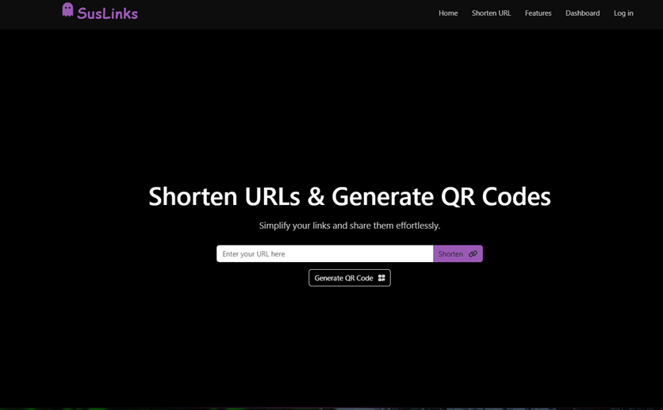
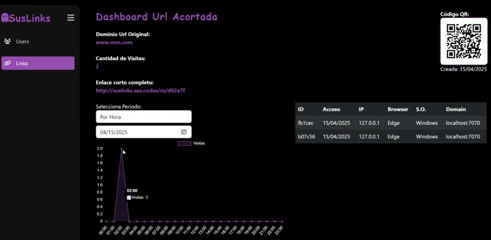
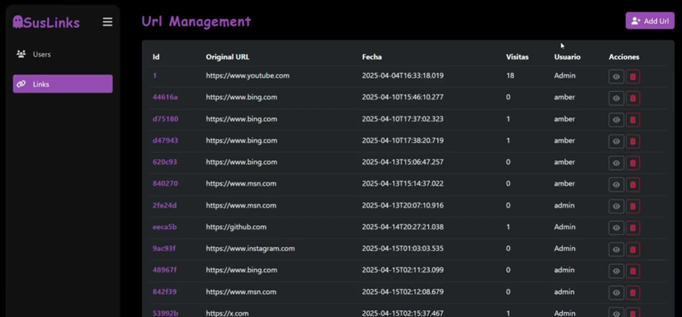

# 🔗 SusLinks — URL Shortener

> A full-featured URL shortener built with Java, Javalin, MongoDB, and Docker.  


---

## 📸 Overview


---

## 📸 URL Shortening in Action


---

## ✨ Features

### 🏠 Public Homepage — URL Shortening
Any visitor (registered or not) can shorten a URL directly from the homepage:

- Paste any long URL into the input field and get a short link instantly
- A **QR code** is automatically generated alongside the short link
- No account required — anonymous sessions are tracked via a unique session ID
- Short links are served under the custom domain `suslinks.sus.codes`
- Redirects are tracked: each click records the visitor's **IP**, **browser**, **operating system**, and **timestamp**

---

### 👤 User Registration & Authentication
- Users can create an account with a **username**, **full name**, **password**, and an optional **profile photo**
- Passwords are encrypted using **Jasypt** before being stored
- Session-based authentication with role differentiation:
  - **Regular users** — can manage their own shortened URLs
  - **Administrators** — have access to the full admin panel

---

### 📊 User Dashboard — My Links
Registered users have access to a personal dashboard where they can:

- View all their shortened URLs in a clean list
- See the **total visit count** for each link
- Access a **detailed statistics page** for each individual URL, including:
  - Hourly visit chart for the current day (using Chart.js)
  - Visit history with browser and OS breakdown
  - The QR code associated with the short link
  - Full visit log with timestamp, IP, browser, and operating system per click



---


### 🛡️ Admin Panel — URL Management (CRUD)
Administrators have access to a dedicated panel to manage **all shortened URLs** across all users:

- **List** all short URLs in the system
- **Delete** any short URL
- View visit statistics for any link

---

### 🛡️ Admin Panel — User Management (CRUD)
Administrators can fully manage user accounts:

- **List** all registered users
- **Create** new users, including assigning admin roles and uploading a profile photo
- **Edit** user information (name, password, role, and profile photo)
- **View** a user's profile details
- **Delete** users (admin accounts are protected from deletion)

---

## 🛠️ Tech Stack

| Layer | Technology |
|---|---|
| **Backend** | Java 21, [Javalin 6](https://javalin.io/) |
| **Templating** | Thymeleaf + FreeMarker |
| **Database** | MongoDB 7 (via Spring Data MongoDB) |
| **QR Generation** | Google ZXing |
| **Auth / Encryption** | Jasypt + JWT (jjwt) |
| **API Docs** | OpenAPI + Swagger UI + ReDoc |
| **Communication** | gRPC + Protocol Buffers |
| **Containerization** | Docker + Docker Compose |
| **Build Tool** | Gradle (Shadow JAR) |

---

## 🐳 Running with Docker

The project includes a fully configured `docker-compose.yml`:

```bash
docker-compose up --build
```

This will spin up:
- **MongoDB** container (`mongo:7`) on the internal network
- **Javalin app** container exposed on port `7000`

The app connects to MongoDB at `mongodb://mongo:27017/SusLinks`.

---

## 🚀 Running Locally

```bash
./gradlew run
```

Make sure a MongoDB instance is running and the `MONGO_URL` environment variable is configured.

---

## 📁 Project Structure

```
src/
├── main/
│   ├── java/app/
│   │   ├── controllers/         # HTTP route handlers
│   │   │   ├── urlController         # URL shortening, redirect, stats
│   │   │   ├── CrudUsuarioController # User CRUD (admin)
│   │   │   └── FotoController        # Profile photo handling
│   │   ├── entidades/           # Domain model (MongoDB documents)
│   │   │   ├── ShortUrl, Usuario, Visita, Foto
│   │   ├── servicios/           # Business logic & DB access
│   │   │   ├── ShortUrlServices, UsuarioServices
│   │   │   ├── VisitaServices, QRCodeGenerator
│   │   │   └── MongoGestionDb        # MongoDB connection manager
│   │   ├── grpc/                # gRPC service definitions
│   │   └── Main.java            # App entry point & route registration
│   └── resources/
│       └── templates/
│           ├── mainpage/             # Public homepage
│           ├── dashboard/            # User & admin dashboards
│           └── crud-tradicional/     # Admin CRUD forms
```

---

## 👥 Authors

| Name | GitHub |
|---|---|
| Amberly Reyes | [@AmberlyReyes](https://github.com/AmberlyReyes) |
| AnthRG | [@AnthRG](https://github.com/AnthRG) |

---

